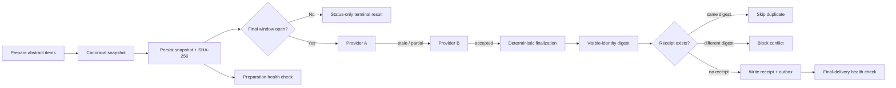

# Goal49 Operations Case Study

[](https://github.com/JINGJAYHUANG/goal49-ops-case-study/actions/workflows/ci.yml)
[](LICENSE)
[](pyproject.toml)

A sanitized reliability-engineering case study extracted from a real scheduled decision pipeline. It focuses on **operations**, not on the private decision model: durable state, freshness gates, provider fallback, idempotent delivery, hard deadlines, health recovery, and evidence-backed incident learning.

The executable reference implementation is fully synthetic, network-free, and uses abstract IDs such as `ITEM-001`. It contains no market data, security identifiers, model factors, rankings, returns, credentials, counterparties, or production endpoints.

> **Status:** public alpha (`v0.1.0`). The repository demonstrates tested reliability controls; it does not claim audited production availability or investment performance.

## Why this case exists

Scheduled automation fails in ways that a notebook or a happy-path script rarely exposes:

- hosted runners are ephemeral;
- scheduled jobs can start late or be skipped;
- live inputs can be stale, partial, duplicated, or unavailable;
- retries can send the same message twice;
- a late recovery can be worse than no output at all;
- diagnostics useful to operators can leak into user-facing messages;
- a successful preparation stage does not prove final delivery.

This repository turns those failure modes into explicit controls and tests.

## Public boundary

| Included | Deliberately excluded |
|---|---|
| Multi-stage orchestration pattern | Private selection or ranking logic |
| Minimal signed preparation snapshot | Real candidates, symbols, prices, or results |
| Freshness and coverage validation | Data-provider credentials or endpoints |
| Ordered provider fallback | Production schedules and business thresholds |
| Stable delivery identity and receipt | Messaging webhook or recipient information |
| Deadline-aware status-only failure | Claims about returns or execution quality |
| Stage-specific health checks | Private repository history or raw incident logs |
| Synthetic Python simulator and tests | Any order-placement or capital-allocation code |

Read the full boundary in [`docs/privacy-boundary.md`](docs/privacy-boundary.md).

## Architecture



The simulator intentionally separates three identities:

1. **snapshot digest** — proves the prepared input set was not changed;
2. **decision diagnostics** — explains provider and validation behavior;
3. **delivery digest** — hashes only the user-visible result, so provider changes do not create duplicate messages.

More detail: [`docs/architecture.md`](docs/architecture.md).

## Controls at a glance

| Failure mode | Control | Executable proof |
|---|---|---|
| Ephemeral runner loses local state | Minimal persisted snapshot | snapshot round-trip tests |
| Snapshot is changed after preparation | Canonical JSON + SHA-256 | tamper-detection test |
| First provider is stale | Freshness gate + ordered fallback | stale-provider fallback test |
| Provider covers too few items | Minimum coverage gate | insufficient-coverage test |
| Retry sends the same result twice | Stable delivery digest + receipt | duplicate-suppression test |
| Rerun produces a conflicting result | First receipt wins; conflict is blocked | receipt-conflict test |
| Job starts after the decision window | Hard deadline; status only | late-run test |
| Preparation or delivery silently fails | Stage-specific health checks | recovery and alert tests |
| Internal diagnostics reach recipients | Separate outbox renderer | no-provider-leak test |
| Outputs vary across clean runs | Canonical serialization | deterministic CI diff |

See [`docs/reliability-controls.md`](docs/reliability-controls.md) for assumptions and residual risk.

## Quick start

No third-party runtime dependencies are required.

```bash
python -m venv .venv
source .venv/bin/activate              # Windows: .venv\Scripts\activate
python -m pip install -e .

goal49-ops-demo run-demo \
  --config examples/synthetic-config.json \
  --universe examples/synthetic-universe.json \
  --workdir .demo
```

The first clean run chooses `provider-b` because `provider-a` is stale. It writes:

```text
.demo/
├── snapshots/DEMO-2026-01-15.json
├── decisions/DEMO-2026-01-15.json
├── receipts/DEMO-2026-01-15.json
└── outbox/DEMO-2026-01-15.txt
```

Run it again against the same work directory and the delivery is marked `duplicate_skipped`. Change the visible result after a receipt exists and the second delivery is marked `blocked_receipt_conflict`.

Verify the snapshot:

```bash
goal49-ops-demo verify \
  --workdir .demo \
  --target DEMO-2026-01-15
```

Evaluate final-stage health:

```bash
goal49-ops-demo health \
  --workdir .demo \
  --target DEMO-2026-01-15 \
  --stage final \
  --checked-at 2026-01-15T01:06:00Z \
  --deadline 2026-01-15T01:05:00Z
```

## Reproduce the release gate

```bash
python -m compileall -q src scripts tests
python -m unittest discover -s tests -v
python scripts/public_audit.py .

rm -rf /tmp/goal49-demo-a /tmp/goal49-demo-b
python -m goal49_ops_case_study.cli run-demo \
  --config examples/synthetic-config.json \
  --universe examples/synthetic-universe.json \
  --workdir /tmp/goal49-demo-a
python -m goal49_ops_case_study.cli run-demo \
  --config examples/synthetic-config.json \
  --universe examples/synthetic-universe.json \
  --workdir /tmp/goal49-demo-b
diff -ru /tmp/goal49-demo-a /tmp/goal49-demo-b
```

## Repository map

```text
src/goal49_ops_case_study/   deterministic reference implementation
examples/                    synthetic inputs only
tests/                       reliability and privacy regression tests
docs/architecture.md         component and sequence design
docs/reliability-controls.md failure-mode/control matrix
docs/incident-timeline.md    sanitized chronology and lessons
docs/evidence-register.md    claim-to-evidence mapping
docs/runbook.md              operator procedures for the demo
docs/decision-records/       architecture decisions
scripts/public_audit.py       secret, path and identifier guard
```

## Evidence standard

Every material statement is labeled as one of:

- **Public executable evidence** — code or test anyone can run here;
- **Sanitized internal evidence** — a pattern observed in the private source system, without publishing its strategy or raw logs;
- **Design inference** — an engineering conclusion, not a measured production result.

The evidence register is in [`docs/evidence-register.md`](docs/evidence-register.md). The sanitized incident chronology is in [`docs/incident-timeline.md`](docs/incident-timeline.md).

## What this does not prove

This repository does **not** prove that:

- GitHub-hosted schedules always start on time;
- any public data endpoint remains stable;
- a file-backed receipt is sufficient for every distributed system;
- the private system achieved a particular uptime, latency, or business outcome;
- synthetic tests replace production monitoring or incident review.

The controls reduce specific failure modes; they do not eliminate platform, network, provider, or human risk.

## Relationship to other projects

This is a **case study** tied to one system's operational evolution. A separate repository, `signal-pipeline-github-actions-template`, is intended to become the reusable generic template. Keeping them separate prevents a sanitized case study from pretending to be a universal production framework.

## License and safety

Code and original documentation are released under the [MIT License](LICENSE). The project is educational software about reliability engineering. It is not investment advice, does not place orders, and should not be used as a production decision service without independent review.
