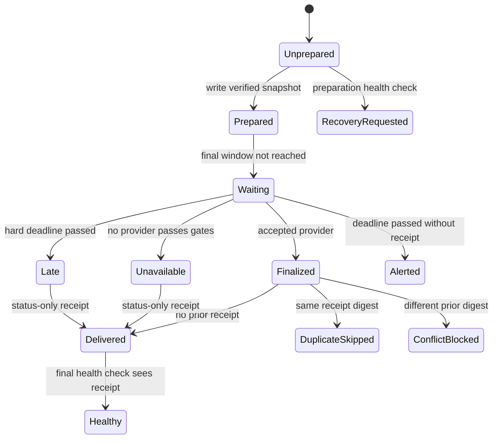

# Architecture

## Design objective

Preserve a trustworthy chain from preparation to one final delivery even when compute is ephemeral, inputs are live, providers fail, and retries occur. The public implementation uses abstract items and a file-backed simulator so each invariant is inspectable.

## Components

| Component | Responsibility | Must not do |
|---|---|---|
| Preparation | Order abstract items and create a minimal snapshot | expose private scoring logic |
| Snapshot store | Persist canonical JSON and its digest | become an unbounded event archive |
| Provider gate | Validate target, time, uniqueness, freshness and coverage | silently mix providers |
| Finalizer | Apply a fixture-only eligibility flag in prepared order | reinterpret private strategy logic |
| Delivery guard | Hash visible identity and write one receipt | hash volatile diagnostics into identity |
| Outbox | Hold a minimal user-facing message | include provider names or debug data |
| Health check | Verify preparation and final delivery independently | generate a late business decision |

## State machine



## Preparation snapshot

The snapshot contains only:

- schema version;
- target identifier;
- source revision identifier;
- preparation timestamp;
- ordered abstract item IDs and ranks;
- SHA-256 digest over the canonical unsigned payload.

It deliberately excludes provider observations, delivery status and operator diagnostics. Those belong to later stages.

## Provider acceptance

Providers are evaluated in a declared order. A batch is accepted only when all conditions hold:

1. its target matches the snapshot target;
2. its observation timestamp is not in the future;
3. its age is within the configured freshness window;
4. item IDs are unique within the batch;
5. coverage of prepared items meets the configured minimum.

The first accepted provider supplies one internally consistent batch. The simulator does not merge partial records across providers because mixed-time/mixed-source semantics are easy to misinterpret.

## Delivery identity

The delivery digest is computed from:

```json
{
  "target": "...",
  "status": "selected | none | unavailable | late | integrity_error",
  "selected_items": ["..."]
}
```

It excludes provider, coverage, timings and diagnostics. A retry that obtains the same visible result through another provider is therefore a duplicate, not a new message.

## Concurrency note

The local simulator proves identity and receipt semantics, not distributed locking. A production deployment must combine the same logic with a single concurrency domain or a transactional store. See `docs/reliability-controls.md` for the residual race condition.
